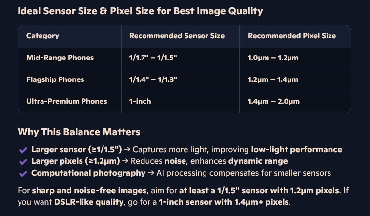

# **Decent Camera Configuration**
### **Sensor Size and Pixel Size:**
- Larger Sensor (>=1/1.5") - captures more light, improves low-light performance. **`[So a at least 1/1.5" sensor is required]`**
- Large Pixels (>=1.2um) - reduces noise and enhances dynamic range.

    

### **Lens Aperture**
- Lower f-number (f/1.8 - f/1.4) - allows more light, improves night photography.
### **Image Processing**
- HDR and Night Mode - improves contrast and clarity in challenging lighting.
### **Stabilization (OIS/EIS)**
- Optical Image Stabilization (OIS) - reduces blur in photos and shaky in videos.
- Electronic Image Stabilization (EIS) - helps smooth out video recording.
### **Frame Rate and Resulation**
- Higher frame rates (60fps, 120fps) - smoother video playback; 4K or higher resolution - ensures sharp and detailed footage.
### **Lenses**
- Multiple lenses (Wide, Ultrawide, Telephoto, Macro) - extends creative possibilities.