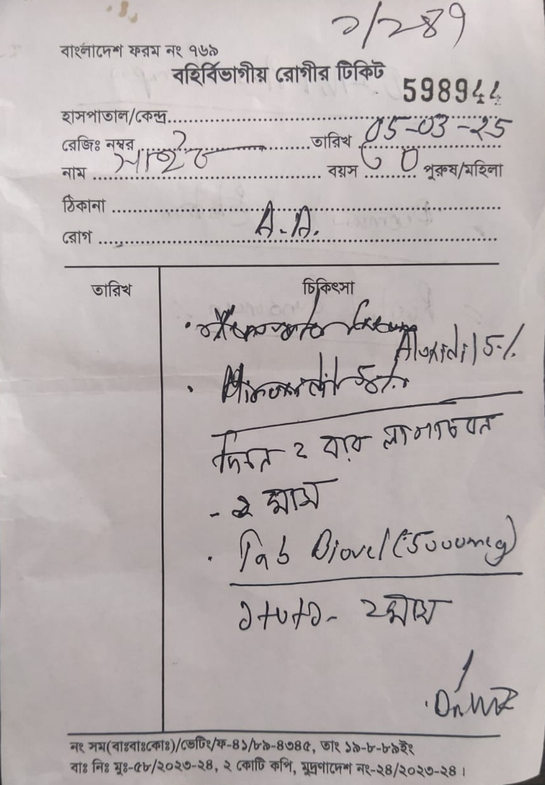
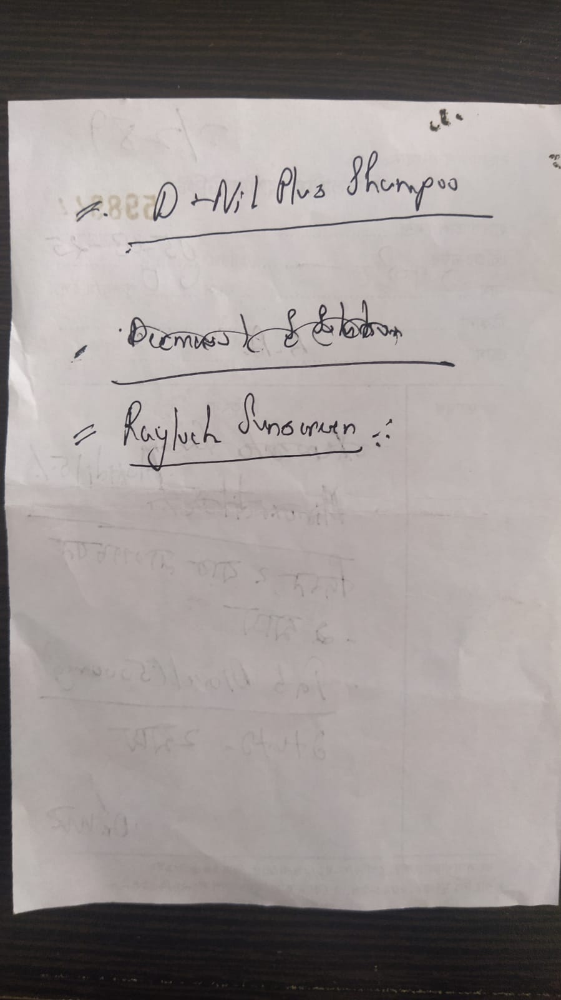

### **What is Alopecia Areata?**
Alopecia Areata is an autoimmune condition that causes hair loss. It occurs when the immune system mistakenly attacks hair follicles, leading to hair loss in small, round patches on the scalp and other areas of the body. [DermNet](https://dermnetnz.org/topics/alopecia-areata?form=MG0AV3) | [Cleveland Clinic](https://my.clevelandclinic.org/health/diseases/12423-alopecia-areata?form=MG0AV3&form=MG0AV3)

**[Autoimmune Condition](https://my.clevelandclinic.org/health/diseases/21624-autoimmune-diseases):** When our immune syetem attacks our own body (cells, fighter becteria etc) instead of defending it. 

### **Treatment of Alopecia Areata**
<table>
    <tr>
        <th>Appointment Date</th>
        <th>Medication</th>
        <th>Remarks</th>    
    </tr>
    <tr>
        <td>Apr 05, 2025</td>
        <td>> Sol : Aluxidil 5% - two times daily for 1 month (topical) > Tab : Viovel (50000 mcg) - 1+0+1 for two months (oral)</td>
        <td>Visit after 1 month</td>    
    </tr>
</table>

- **Date of Doctor Appointment:** 05 March 2025
- **Chittagong Medical College:** Department of Darmatology (Outer Division)
- **Prescription:** 
     
