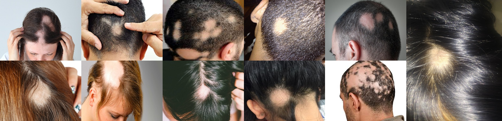
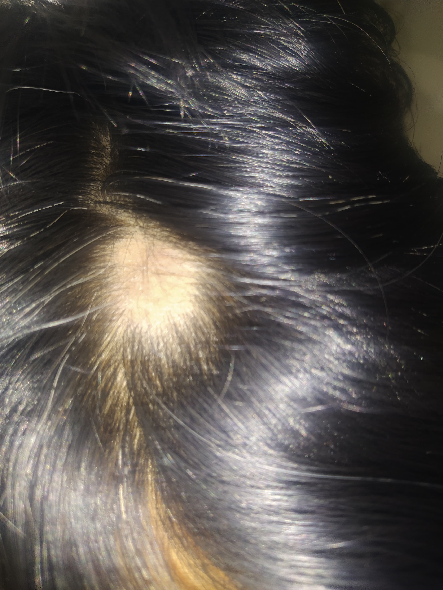
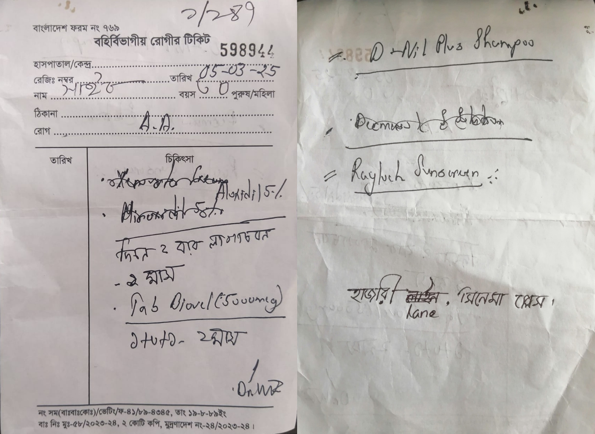

### **What is Alopecia Areata?**
Alopecia Areata is an autoimmune condition that causes hair loss. It occurs when the immune system mistakenly attacks hair follicles, leading to hair loss in small, round patches on the scalp and other areas of the body. [DermNet](https://dermnetnz.org/topics/alopecia-areata?form=MG0AV3) | [Cleveland Clinic](https://my.clevelandclinic.org/health/diseases/12423-alopecia-areata?form=MG0AV3&form=MG0AV3)

**[Autoimmune Condition](https://my.clevelandclinic.org/health/diseases/21624-autoimmune-diseases):** When our immune syetem attacks our own body (cells, fighter becteria etc) instead of defending it. 

### **Treatment of Alopecia Areata**
<table>
    <tr>
        <th>Appointment Date</th>
        <th>Medication</th>
        <th>Remarks</th>
        <th>Visual Condition</th>    
    </tr>
    <tr>
        <td>05/03/2025</td>
        <td>> Sol (topical) : Aluxidil 5% - two times daily for 1 month > Tab (oral) : Viovel (5000 mcg) - (1 + 0 + 1) for 2 months</td>
        <td>Visit after 1 month</td>
        <td></td>
    </tr>
</table>

- **Prescription (05/03/2025):** 
    
