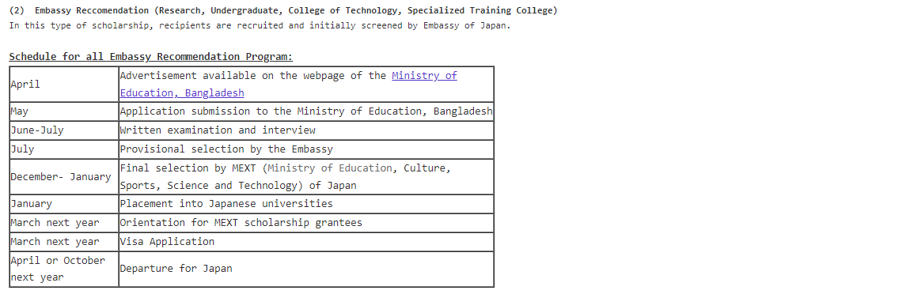
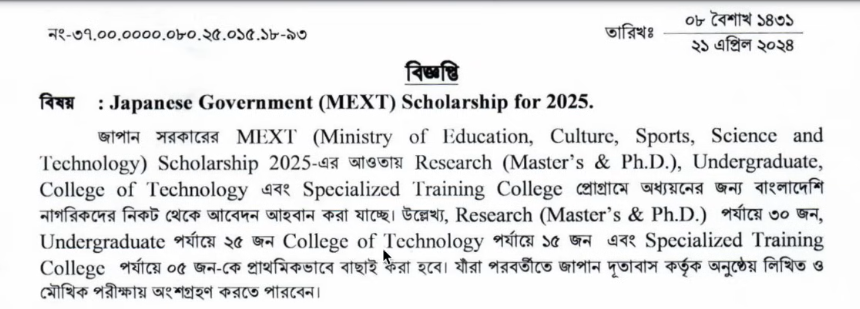
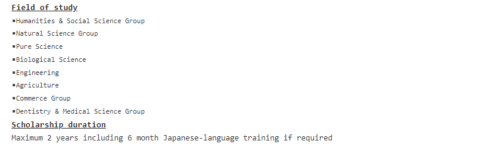

### **Important Links:**
- [Embasy of Japan, Bangladesh](https://www.bd.emb-japan.go.jp/itpr_en/scholarshipnotice.html)

### **Types of MEXT Scholarship:**
1. **Embassy Track:** MEXT Scholarship through Embasy Bangladesh

2. **University Track:** MEXT Scholarship through Japan University
    - a）University Recommendation is a type of selection that students are recommended to MEXT by the Japanese university which will accept you as a research student. The applicants submit their applications to Japanese Unviersities directly, and the  selected candidates are recommended to MEXT from each university. MEXT conducts a screening and selects scholarship grantees at the end of June. They normally arrive in Japan in the end of September.
    - b) The qualification and eligibility varies according to each university. Please visit website of Japanese universities for the details. Please visit website of each Japanese university for the details.
    - c) The application period normally starts in November-December and ends in January-February.

### **Embasy Track**
- There will be a newsletter published from the embasy and the Education Ministry of Bangladesh will publish it. We can then apply for the scholarship following the newsletter. `Normaly in April for the next year`

#### **Courses and Scholarship Numbers (2025)**

`Those who are applying for undergrad or any other program (except - Masters or PHD) have to apply through embasy track.`

#### **Research Study (Masters and PHD)**

**Fields of Study**

**Eligibility to Apply**
- Age below 35 as of April 1 of the scholarship receiving year.
- For Master’s Course, those who have completed a bachelor’s course or have 16 years of school education.
- For Doctoral Course who have completed a master’s course or have 18 years of school education.
- Only Bangladehsi national can apply from Bangladesh

**Accademic Qualification** 
All through first class (Mark 60% or CGPA 3.5 out of 4)

**Written Exam**
- English or Japanese
- Previous Questions: [past exam papers](https://www.studyinjapan.go.jp/en/planning/scholarships/mext-scholarships/examination.html)